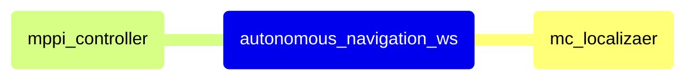

<div align="center">

  # Autonomous Navigation Workspace
  
  Autonomous Navigation of Indoor Mobile Robot with 2D LiDAR and IMU

  [](https://docs.ros.org/en/humble/)
  [](http://gazebosim.org/)
  [](https://isocpp.org/)

</div>

--- 

## 🚀 Quick Start

```bash
source /opt/ros/humble/setup.bash
. install/local_setup.bash
```

rviz

```bash
apt-get update
apt-get install -y tigervnc-standalone-server tigervnc-common novnc websockify
websockify --web=/usr/share/novnc/ 8080 localhost:5901

source /opt/ros/humble/setup.bash
. install/local_setup.bash
rviz2
```

http://localhost:8080/vnc.html

---

## 🏗️ Technical Architecture

- [Localization] Monte Carlo Localization
- [Control] Model Predictive Path Integral Control

### Architecture Diagram



### Project Structure

    autonomous_navigation_ws
    └── src/
        ├── mc_localizater/              # localization
        └── mppi_controller/             # control

---
