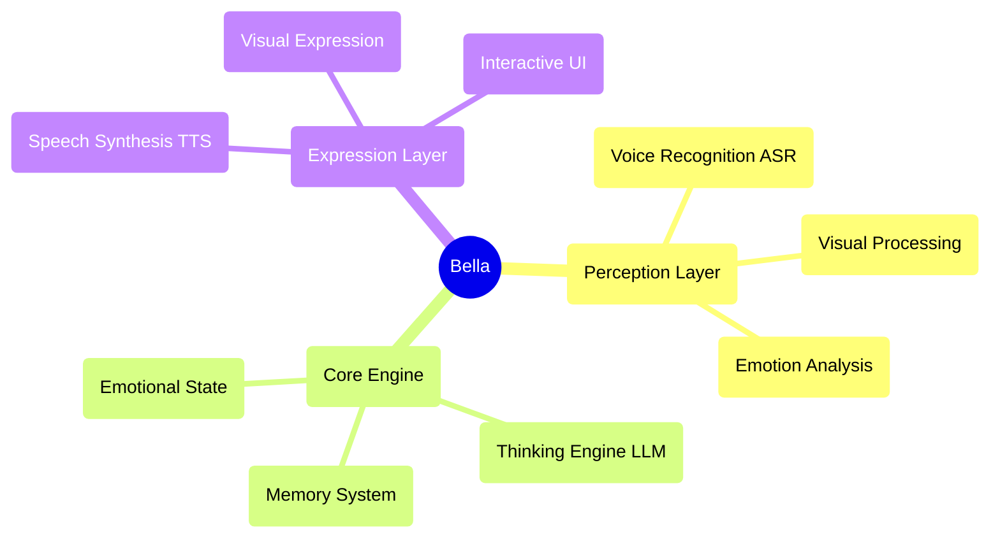

<div align="center">

  # Autonomous Navigation Workspace
  
  Autonomous Navigation of Indoor Mobile Robot with 2D LiDAR and IMU
  
  [](https://docs.ros.org/en/humble/)

  
</div>

--- 

## 🚀 Quick Start

```bash
source /opt/ros/humble/setup.bash
. install/local_setup.bash
```

rviz

```bash
apt-get update
apt-get install -y tigervnc-standalone-server tigervnc-common novnc websockify
websockify --web=/usr/share/novnc/ 8080 localhost:5901

source /opt/ros/humble/setup.bash
. install/local_setup.bash
rviz2
```

http://localhost:8080/vnc.html

---

## System Requirement

- ROS2 Humble

## Tested Environment

- Mac M1

## 🏗️ Technical Architecture

- [Localization] Monte Carlo Localization
- [Local Planner] Model Predictive Path Integral Control

### Architecture Diagram



---

## 📁 Project Structure

    autonomous_navigation_ws
    └── src/
        ├── monte_carlo_localization/             # localization
        └── mppi_planner/                         # local planner

---