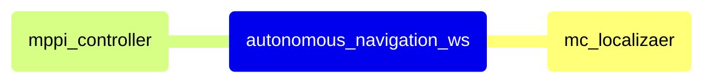

<div align="center">

  # Autonomous Navigation Workspace
  
  Indoor Autonomous Navigation of Mobile Robot with 2D LiDAR and IMU

  [](https://docs.ros.org/en/humble/)
  [](http://gazebosim.org/)
  [](https://isocpp.org/)

</div>

--- 

## 🚀 Quick Start

기타

```bash
conda deactivate
conda remove --name "autonomous_navigation_env" --all
rm -rf build install log
```

1. Install ROS Humble

```bash
eval "$(/Users/wontothree/miniforge3/bin/conda shell.zsh hook)"

conda create -n "autonomous_navigation_env"
conda activate "autonomous_navigation_env"

# this adds the conda-forge channel to the new created environment configuration 
conda config --env --add channels conda-forge

# and the robostack channel
conda config --env --add channels robostack-staging

# remove the defaults channel just in case, this might return an error if it is not in the list which is ok
conda config --env --remove channels defaults


# Install ros-humble into the environment (ROS2)
conda install ros-humble-desktop

conda deactivate
conda activate "autonomous_navigation_env"

# test rviz
rviz2
```

2. Install Gazebo

```bash
conda config --add channels conda-forge
conda config --add channels robostack-humble
conda config --set channel_priority strict

# Modern Gazebo
conda install ros-humble-gazebo-ros-pkgs

# test gazebo
gazebo
```

3. Colcon buuild

```bash
conda install colcon-common-extensions -c conda-forge

conda install -c conda-forge cmake

colcon build
# or
colcon build --symlink-install

source install/setup.zsh
```

4. Gazebo

```bash
nano ~/.gazebo/gui.ini

[model_paths]
filenames=/Users/wontothree/Desktop/develop/autonomous_navigation_ws/src/gazebo_simulator/GazeboFiles/models

export ROS_DOMAIN_ID=1
gazebo install/gazebo_simulator/share/gazebo_simulator/worlds/simulator.world
```

---

## 🏗️ Technical Architecture

- [Localization] Monte Carlo Localization
- [Control] Model Predictive Path Integral Control

### Architecture Diagram



### Project Structure

    autonomous_navigation_ws
    └── src/
        ├── mc_localizater/              # localization
        └── mppi_controller/             # control

---

## Docker 

```bash
source /opt/ros/humble/setup.bash
colcon build
source install/setup.bash
```

```bash
apt update
apt install ros-humble-gazebo-ros-pkgs
export GAZEBO_AUDIO=false
gazebo

gazebo /autonomous_navigation_ws/install/gazebo_simulator/share/gazebo_simulator/worlds/simulator.world
```

```bash
brew install --cask xquartz
open -a XQuartz

```